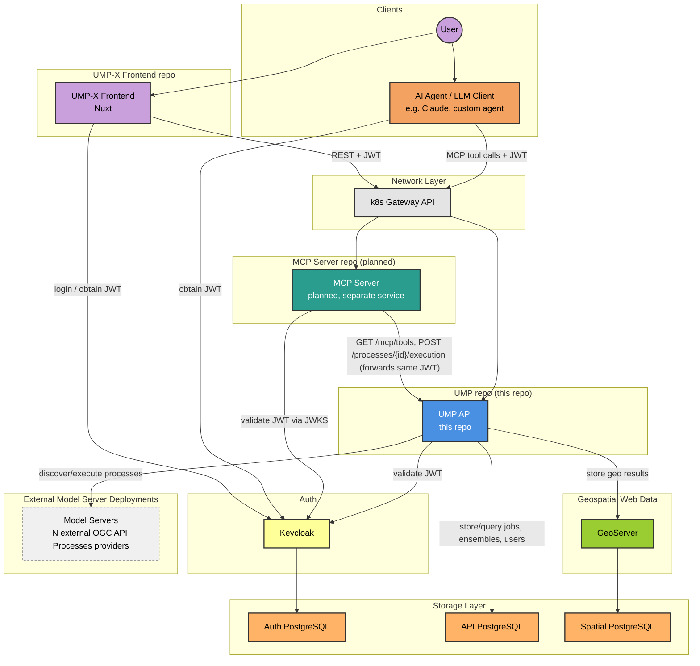

# UMP-X System Architecture

UMP-X expands the Urban Model Platform (this repo) with two new components:

1. **UMP-X Frontend** ([`ump-x-frontend`](https://github.com/Urban-Futures-Collective/ump-x-frontend)) — a web UI for browsing providers/processes, running jobs, and viewing results.
2. **MCP Server** — an Agent Experience (AX) layer that exposes UMP processes as MCP tools so LLMs/agents can discover and invoke them (see [`mcp-integration-strategy.md`](./mcp-integration-strategy.md) for the detailed design). This is planned, not yet implemented, and is intended to ship as an independently deployed service ("sidecar"), not as code inside this repo.

Since UMP, the frontend, and the MCP server are separate deployable projects, **Keycloak is the one component all three depend on directly** and is what keeps them consistent with each other. Each service validates the same user JWT independently (zero-trust — see strategy doc §3) rather than trusting a single upstream check.

## Component dependency diagram

## Components and ownership

| Component | Repo / deployment | Responsibility |
|---|---|---|
| UMP-X Frontend | `ump-x-frontend` | Human-facing UI: browse providers/processes, submit jobs, view job/ensemble results. |
| AI Agent / LLM Client | external (Claude, ChatGPT, custom agents, etc.) | Any MCP client acting on a user's behalf; not part of UMP-X itself. |
| MCP Server | new repo, planned | Translates UMP processes into MCP tools (discovery + execution), enforces its own JWT validation, forwards the original user JWT to UMP unchanged. |
| UMP API | this repo | Source of truth for providers/processes, job lifecycle, role-based authorization, results retrieval/storage. |
| Keycloak | shared infra | Issues and signs JWTs; the only identity provider all three services trust. |
| Model Servers | external, one per provider in `providers.yaml` | Actually execute simulation/model jobs; OGC API Processes-compliant. |
| GeoServer | shared infra | Serves geospatial job results as WFS/WMS layers. |
| API / Auth / Spatial PostgreSQL | shared infra | Separate databases for UMP job/ensemble/user data, Keycloak realm data, and GeoServer's spatial datastore, respectively. |

## Why every service talks to Keycloak directly

Per the zero-trust model in the MCP strategy doc: a single login gets a user one JWT, but **every** service that receives that JWT (UMP, MCP) validates it independently against Keycloak's JWKS rather than trusting that an upstream hop already checked it. This means:

- Keycloak is a hard dependency for the frontend (login), the MCP server (token validation), and UMP (token validation) — not just for UMP as today.
- The MCP server never talks to the UMP or Keycloak databases directly, and never mints its own identities — it only forwards the user's original JWT to UMP, which remains the final authority on process-level authorization (provider-level and process-level roles, `anonymous_access`).
- Because of this, UMP's existing role model (`{provider}` and `{provider}_{process_id}` Keycloak client roles) does not need to be duplicated or reimplemented in either the frontend or the MCP server.
